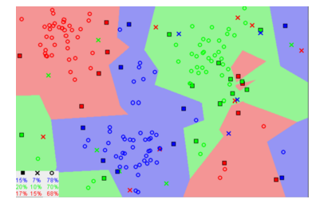
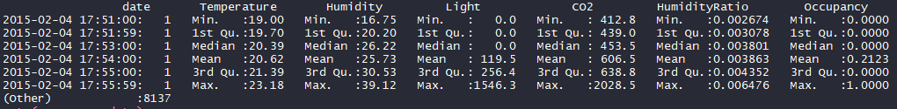
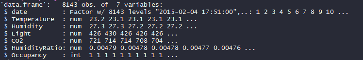
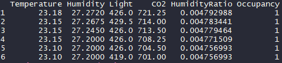
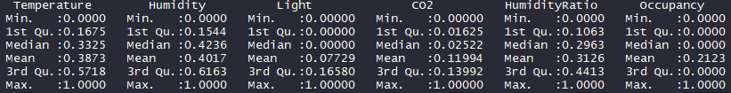
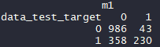

# K-nearest Neighbours algorithm on an Occupancy Detection dataset

The project consists of showing how to implement K-nearest Neighbours on an Occupancy Detection dataset.

# Getting Started

- Download [https://code.visualstudio.com/] or another alternative source-code editor of your preference.
- Download the project on [https://github.com/taxenco/K-Nearest_Neighbor_R].
- Go to your terminal and run the following command --> git clone https://github.com/taxenco/K-Nearest_Neighbor_R.
- Access to Visual Studio Code or another alternative source-code editor and open the project. Alternatively, you can access the project on through the terminal.
- Download R support for Visual Studio Code.

# Prerequisites

- Visual Studio Code or another alternative source-code editor.
- Linux.
- R support for Visual Studio Code.
- Package ‘class’[3]
- Txt files.

# Objective of the project

This project will perform a classification K-nearest Neighbours (KNN) on an Occupancy Detection dataset for classifying the occupancy.

# Theory on K-nearest Neighbours

The k-nearest neighbours’ algorithm (k-NN) is a non-parametric method used for classification and regression [1].

In k-NN classification, the output is a class membership. An object is classified by a plurality vote of its neighbours, with the object being assigned to the class most common among its k nearest neighbours (k is a positive integer, typically small). If k = 1, then the object is simply assigned to the class of that single nearest neighbour.

# Data

The data selected is an Occupancy Detection dataset. The data used was found on:

https://archive.ics.uci.edu/ml/datasets/Occupancy+Detection+
The dataset is made 6 decision variables and 1 class variable.

·         date time year-month-day hour: minute: second

·         Temperature, in Celsius

·         Relative Humidity, %

·         Light, in Lux

·         CO2, in ppm

·         Humidity Ratio, Derived quantity from temperature and relative humidity, in kgwater-vapor/kg-air

·         Occupancy, 0 or 1, 0 for not occupied, 1 for occupied status

# Data cleaning

The dataset is already cleaned, and it is ready for performing the decision tree.

# Calculating K-nearest Neighbours

This section will show how to calculate K-nearest Neighbours on an Occupancy Detection dataset.
 
Let ‘s start inspecting the dataset:
 
Five-number summary
 

Data-frame
 

 
As we can see, the data is clean, we will remove the date attribute since it is not necessary for building the model
 

 
We will normalize the data to avoid outliers to bias the data and therefore the results.
 

We will split the dataset into two parts — 80 % for training and 20% for validation. Now we can build the KNN model with the training data, and we will assign K = 13. 
 
Once the algorithm is built, we can confront it with test data and see how good it has performed.
 

 
- classification accuracy =  0.7520099

- classification error =   0.2479901
 
# Conclusion
K-nearest Neighbours is an excellent algorithm for classification and very simple to implement. However, the KNN can get slower as the number of independent variables increases.
The results of the KNN were pretty good, taking into the consideration that K was chosen randomly; therefore, the results could potentially improve by tuning the algorithm and by having a larger dataset.
# References

* 1 - https://en.wikipedia.org/wiki/K-nearest_neighbors_algorithm
* 2 - MSc Data science notes, Salford University. K-nearest Neighbours
* 3 - https://cran.r-project.org/web/packages/class/class.pdf

# Built With

- Linux - Operating system.
- R programming language.
- Txt files.
# Authors

Carlos Beltran.

# Acknowledgments

The author would like to thank Salford University.

 

 